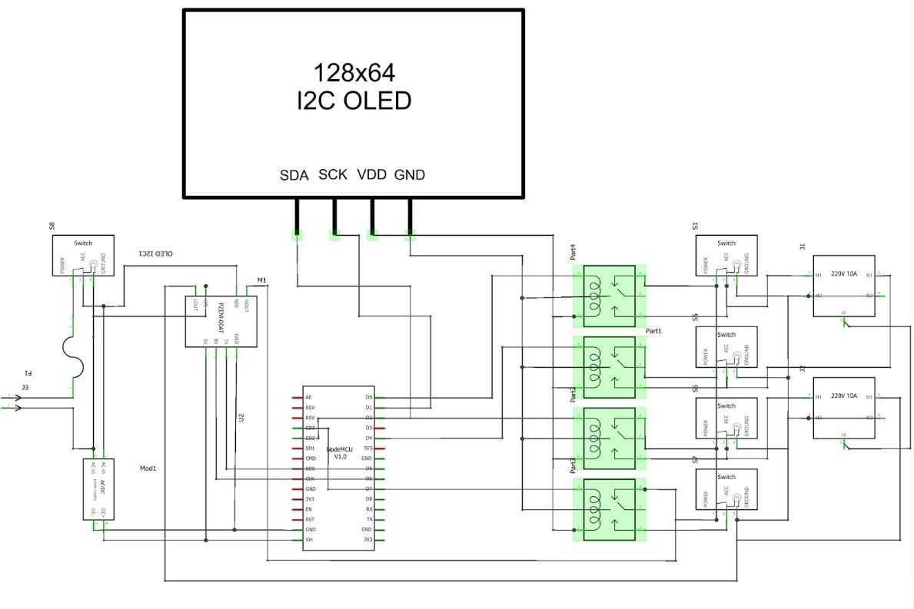

# ESP8266-Based Extension Outlet Scheduler with Time Adjustments and Real-Time Monitoring via Local Web Server

## Project Overview

This project is a Power Management System that utilizes the ESP8266 microcontroller to control and monitor extension outlets in a residential setting. The system allows users to schedule on/off times for connected devices, view real-time power consumption data, and receive alerts when energy usage thresholds are exceeded. The user interface is accessed via a local web server, making it easy to manage connected appliances.

## Features

- **Automated Scheduling**: Schedule appliances to turn on/off at specific times to reduce manual intervention.
- **Real-Time Monitoring**: Monitor power consumption and energy usage of connected devices in real-time.
- **Alert System**: Receive alerts when devices exceed specified energy usage thresholds.
- **User-Friendly Web Interface**: Control and monitor the system via a local web server accessible on any device within the network.

## Materials Used

- **NodeMCU ESP8266**: For controlling and monitoring the power outlets.
- **SSR-40DA**: Solid State Relay for controlling the on/off state of appliances.
- **Universal Outlet**: Standard outlet socket used in the extension.
- **PZEM-004T V3 Module**: Module for measuring power consumption.
- **Switch**: SPST switch for manual control.
- **0.96 OLED**: Display for real-time feedback on device status.
- **Case 3D**: Custom 3D-printed case for housing the components.
- **IEC 320 Inlet AC Power Plug Socket**: Used for connecting the power supply to the device.
- **220V to 5V DC Converter**: For providing the necessary power to the ESP8266 and other components.

## Circuit Diagram



## Installation Guide for ESP8266 Core and Required Libraries in Arduino IDE

To successfully compile and run the code for this project, you'll need to install the ESP8266 core as well as several libraries in the Arduino IDE. Follow these steps to set up your development environment.

### Step 1: Install ESP8266 Core in Arduino IDE

1. **Open Arduino IDE**:
   - Ensure you have the Arduino IDE installed on your computer. If not, download it from the [official Arduino website](https://www.arduino.cc/en/software).

2. **Add ESP8266 Board URL**:
   - Open Arduino IDE and go to **File > Preferences**.
   - In the "Additional Board Manager URLs" field, paste the following URL:
     ```
     http://arduino.esp8266.com/stable/package_esp8266com_index.json
     ```
   - Click "OK" to save your changes.

3. **Install the ESP8266 Core**:
   - Go to **Tools > Board: > Boards Manager...**.
   - In the Boards Manager window, scroll down to find the **ESP8266** platform.
   - Select the latest version and click the **Install** button.

4. **Finalizing**:
   - After installation, restart the Arduino IDE.
   - Go to **Tools > Board:** and select **NodeMCU 1.0 (ESP-12E Module)** or another ESP8266 board that matches your hardware.

### Step 2: Install Required Libraries

1. **Open the Arduino Library Manager**:
   - Go to **Sketch > Include Library > Manage Libraries...**.

2. **Install Libraries via Library Manager**:
   - **Adafruit SSD1306**: 
     - Search for **Adafruit SSD1306** and install it.
   - **Adafruit GFX**:
     - Search for **Adafruit GFX** and install it.
   - **ArduinoJson**:
     - Search for **ArduinoJson** and install the latest version (version 6.x.x).
   - **ESP8266WebServer**:
     - Search for **ESP8266WebServer** and install it.
   - **PZEM004T**:
     - Search for ***PZEM004T** and install it.

### Step 3: Upload the Code

1. Once all libraries are installed and the code compiles without errors, connect your ESP8266 board to your computer via USB.
2. Select the correct board and port in **Tools > Board** and **Tools > Port**.
3. Click the **Upload** button to upload the code to your ESP8266.

By following these steps, your development environment will be ready to compile and run the Power Management System project. If you encounter any issues during installation, refer to the library documentation or seek support.

## How to Use

### 1. Powering On the Device

1. **Connect the Power**: Plug in the device into an AC power outlet.

2. **Wait for Initialization**:
- If the device is already connected to your router, it will automatically connect, and you can skip the setup.
- **If the device is not connected to your router**:
  1. Connect to the device's Wi-Fi Access Point (AP) manually. The AP name is **"Setup Portal"**.
  2. Once connected, open a web browser and navigate to **"http://192.168.4.1"**.
  3. On the portal page, enter the SSID and password of your router.
  4. The device will then attempt to connect to the provided network credentials.

### 2. Connecting to the Web Interface

1. **Access the Web Interface**:
- Open a web browser on any device connected to the same local network.
- Enter the IP address displayed on the OLED into the browser's address bar (e.g., `http://192.168.0.100`).
- Alternatively, if you are using a laptop or desktop, you can type `outlet.local`.

### 3. Scheduling Appliances

1. **Navigate to the Scheduler**:
- Once on the web interface, select one of the outlet names, such as **OUTLET 1 - 4**.
2. **Set On/Off Times**:
- Click on the week names to add a schedule.

### 4. Monitoring Power Consumption

1. **View Real-Time Data**:
- In the web interface, navigate to the **Power Consumption** section.
- Here, you can see real-time power usage statistics for each connected appliance.
2. **Check Usage History**:
- Review past usage data to understand your consumption patterns and make informed decisions.

### 5. Receiving Alerts

1. **Set Energy Usage Thresholds**:
- Go to the **Power Consumption** section in the web interface.
- Click the **Add Energy Limit** button to set an energy usage limit.

### 6. Manual Control

1. **Use Physical Switches**:
- Each outlet is equipped with a manual SPST switch.
- You can turn an appliance off manually without affecting the set schedules.

### 7. Troubleshooting
- **No Power to the Device**:
  - Check that the 220V to 5V DC converter is functioning correctly.
  - Ensure the power plug is securely connected.

- **Cannot Access Web Interface**:
  - Verify the ESP8266 is connected to the correct Wi-Fi network.
  - Ensure your device is on the same network as the ESP8266.

- **Incorrect Time or Date**:
  - Reboot the device to sync the correct time with the server.

By following these instructions, you can effectively control and monitor your home appliances using the Power Management System. If you encounter any issues, please refer to the troubleshooting section or contact us for support.

## Cloning the Repository

```bash
git clone https://github.com/John-Bernardo-Laboratory/ESP8266-Automated-Outlet-Scheduler.git

